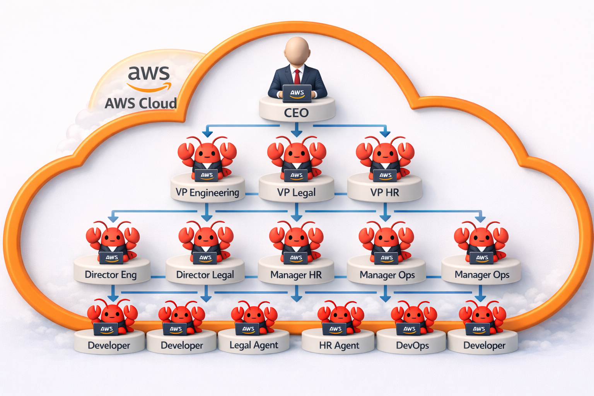

# Open-Claw-Fleet

> Deploy thousands of autonomous AI agents in a secure AWS containerized environment



Open-Claw-Fleet enables organizations to run entire teams of [OpenClaw](https://openclaw.ai) AI agents on AWS ECS, creating a scalable, autonomous workforce that operates 24/7 in isolated, secure containers.

## Overview

Open-Claw-Fleet transforms the way organizations leverage AI by deploying complete organizational structures—from C-suite executives to individual contributors—as autonomous OpenClaw agents. Each agent runs in its own containerized environment on Amazon ECS, providing isolation, scalability, and enterprise-grade security.

### What is OpenClaw?

OpenClaw is an open-source, autonomous AI agent framework that:
- Runs locally with persistent memory across sessions
- Executes real tasks (not just suggestions)
- Integrates with messaging platforms (WhatsApp, Telegram, Discord, Slack, etc.)
- Provides tool execution capabilities (shell commands, browser automation, file operations)
- Supports extensible skills through a modular plugin system

Built in TypeScript, OpenClaw operates as a conversation-first agent that can autonomously handle complex workflows, remember context, and coordinate across multiple services.

## Why Open-Claw-Fleet?

Traditional AI assistants are limited to single-user, single-session interactions. Open-Claw-Fleet scales this to organizational levels:

- **Scalability**: Deploy hundreds or thousands of agents simultaneously
- **Organizational Structure**: Mirror real company hierarchies with AI agents
- **Isolation**: Each agent runs in its own secure container
- **Persistence**: Agents maintain memory and context across restarts
- **AWS Integration**: Leverage ECS, VPC, IAM, and other AWS services for enterprise deployment
- **Cost Efficiency**: Pay only for active container time

## Architecture

```
┌─────────────────────────────────────────────────────────┐
│                     AWS Cloud                           │
│                                                          │
│  ┌────────────────────────────────────────────────┐   │
│  │              Amazon ECS Cluster                 │   │
│  │                                                  │   │
│  │  ┌──────────┐  ┌──────────┐  ┌──────────┐     │   │
│  │  │   CEO    │  │   VP     │  │ Director │     │   │
│  │  │  Agent   │  │  Agent   │  │  Agent   │     │   │
│  │  └──────────┘  └──────────┘  └──────────┘     │   │
│  │                                                  │   │
│  │  ┌──────────┐  ┌──────────┐  ┌──────────┐     │   │
│  │  │ Manager  │  │Developer │  │   HR     │     │   │
│  │  │  Agent   │  │  Agent   │  │  Agent   │     │   │
│  │  └──────────┘  └──────────┘  └──────────┘     │   │
│  │                                                  │   │
│  │  Each container runs OpenClaw with:            │   │
│  │  - Persistent EFS storage                       │   │
│  │  - Messaging platform connections               │   │
│  │  - Role-specific skills and permissions         │   │
│  └────────────────────────────────────────────────┘   │
│                                                          │
│  ┌────────────────────────────────────────────────┐   │
│  │         Supporting Infrastructure               │   │
│  │  - VPC with private/public subnets              │   │
│  │  - EFS for persistent agent memory              │   │
│  │  - CloudWatch for monitoring & logs             │   │
│  │  - Secrets Manager for credentials              │   │
│  └────────────────────────────────────────────────┘   │
└─────────────────────────────────────────────────────────┘
```

## Use Cases

### Organizational Hierarchy

Deploy a complete company structure as AI agents:

- **Executive Layer**: CEO agent for strategic decisions and oversight
- **Management Layer**: VP and Director agents for departmental coordination
- **Operational Layer**: Manager agents for team leadership
- **Individual Contributors**: Developer, analyst, and specialist agents
- **Support Functions**: HR, Legal, Finance, and Operations agents

### Department Examples

**Engineering Department**
- VP of Engineering (coordinates all engineering efforts)
- Engineering Managers (oversee specific teams)
- Developer Agents (write code, review PRs, fix bugs)
- DevOps Agents (manage deployments, monitor infrastructure)

**Legal Department**
- General Counsel (strategic legal oversight)
- Contract Review Agents (analyze agreements)
- Compliance Agents (monitor regulatory requirements)

**Human Resources**
- HR Director (workforce planning)
- Recruiting Agents (candidate screening)
- Onboarding Agents (new hire processes)

## Features

- **Container-Based Deployment**: Each agent runs in isolated ECS containers
- **Persistent Memory**: EFS-backed storage ensures agents remember context across restarts
- **Multi-Channel Communication**: Agents connect to Slack, Discord, email, and other platforms
- **Role-Based Access**: IAM policies and security groups enforce agent permissions
- **Monitoring**: CloudWatch integration for logs, metrics, and alerts
- **Infrastructure as Code**: AWS CDK for reproducible deployments

## Project Structure

```
open-claw-fleet/
├── config/                 # Environments, templates, local compose
│   ├── templates/          # Shared templates + skills
│   └── environments/       # Per-env config + workspaces
├── packages/               # Workspace packages
│   ├── setup/
│   │   ├── fleet-config/   # TUI for editing config.yaml
│   │   ├── fleet-manager/  # Generator + orchestrator
│   │   └── agent-runtime/  # Container entrypoint per agent
│   ├── plugins/
│   │   └── people/         # Org directory tool
│   └── aws/
│       └── infra/          # AWS CDK infrastructure code
├── docs/                   # Project documentation
├── sample/                 # Reference only (do not modify)
└── poc/                    # Proof of concepts (do not modify)
```

## Important Notes

- `poc/` is reference only and must not be modified.
- `sample/` is reference only and must not be modified.

## Prerequisites

- **AWS Account** with appropriate permissions
- **Node.js** ≥ 20.0.0
- **AWS CDK** CLI installed (`npm install -g aws-cdk`)
- **Docker** for local testing
- **AWS CLI + Session Manager Plugin** (required by `fleet-connect`; no manual CLI steps)

## Documentation

📚 **[Complete Documentation](docs/README.md)**

### Quick Links

- **[Architecture](docs/architecture.md)** - System design and AWS components
- **[Deployment Guide](docs/deployment-guide.md)** - Step-by-step AWS deployment
- **[AWS Setup](docs/aws-environment-setup.md)** - Configuration and secrets management
- **[Agent Deployment](docs/findings/agent-deployment.md)** - Challenges, solutions, and lessons learned
- **[Troubleshooting](docs/TROUBLESHOOTING.md)** - Common issues and solutions

## Quick Start

### 1. Clone and Install

```bash
git clone https://github.com/manu-mishra/open-claw-fleet.git
cd open-claw-fleet
npm install
```

### 2. Deploy to AWS

```bash
# Deploy infrastructure (builds and pushes all images)
./scripts/deploy-aws-env.sh
```

This deploys:
- Shared stack: ECR repositories
- Dev stack: VPC, ECS cluster, services (Conduit, Element, Fleet Manager)
- All services start at `desiredCount: 1`
- Fleet Manager handles agent lifecycle (no manual scaling required)

### 3. Connect to Element UI

```bash
# Single command to connect to all services
npm run fleet:connect
```

Then open: **http://localhost:8080**

You'll see the **Open-Claw-Fleet-Command-Center** with custom branding!

### 4. Local Development (Matrix + Fleet Manager)

```bash
# Build workspace packages
npm run build

# Build agent image
docker build -t openclaw-agent:latest -f config/environments/local/Dockerfile.agent .

# Set runtime env
export FLEET_SECRET=test123
export HOST_ROOT="$(pwd)"

# Optional: set AWS credentials if using Bedrock (via environment variables)

# Start local stack
cd config/environments/local
docker compose up -d
```

Or use the helper script:

```bash
scripts/local-fleet.sh up
```

## Tools

### Fleet Connect (`npm run fleet:connect`)

Automatically connects to AWS-deployed services via SSM port forwarding:
- Discovers bastion and service IPs
- Forwards Conduit (Matrix) and Element (UI) ports
- Single process, graceful shutdown
- Located in `packages/tools/fleet-connect/`

### Fleet Config (`npm run fleet:config`)

Terminal UI for editing fleet configuration:
- Manage agent definitions
- Configure workspaces
- Edit Matrix settings
- Located in `packages/setup/fleet-config/`

## Roadmap

- [x] Base ECS cluster infrastructure
- [x] Container definitions for OpenClaw agents
- [x] EFS integration for persistent storage
- [x] Multi-agent communication patterns (Matrix/Conduit)
- [x] Custom branding (Open-Claw-Fleet-Command-Center)
- [x] SSM-based secure access (fleet-connect tool)
- [x] Deterministic password derivation for agents
- [x] Agent deployment and Matrix authentication
- [x] OpenClaw gateway running in containers
- [ ] Agent health monitoring and auto-restart
- [ ] Role-based agent templates (CEO, VP, Manager, etc.)
- [ ] Messaging platform integrations (WhatsApp, Telegram, Discord)
- [ ] Monitoring and observability dashboards
- [ ] Auto-scaling policies
- [ ] Web UI for fleet management

## Proof of Concepts

### [Matrix Agent Communication](poc/matrix-agents/) ✅ VERIFIED WORKING

Multi-agent AI system using OpenClaw in Docker containers communicating via Matrix protocol.

**What's Working:**
- Agents register and communicate via Matrix (Conduit server)
- Auto-created rooms based on org hierarchy (#executive-team, #engineering-leadership)
- People directory plugin for org lookups (1001 employees)
- Agent-to-agent conversations (VP ↔ Director)
- GPT OSS and Claude Haiku models via Amazon Bedrock

**Agents Deployed:**
| Agent | Role | Matrix ID |
|-------|------|-----------|
| Braxton Roberts | VP of Engineering | @braxton.roberts:anycompany.corp |
| Dylan Thomas | Director of Platform | @dylan.thomas:anycompany.corp |
| Manu Mishra | CEO (human) | @manu.mishra:anycompany.corp |

**Quick Start:**
```bash
cd poc/matrix-agents
# Set AWS credentials in your environment if using Bedrock
cat > .env << 'EOF'
AWS_REGION=us-east-1
AWS_ACCESS_KEY_ID=$AWS_ACCESS_KEY_ID
AWS_SECRET_ACCESS_KEY=$AWS_SECRET_ACCESS_KEY
AWS_SESSION_TOKEN=$AWS_SESSION_TOKEN
EOF
docker compose up -d
# Register CEO user
curl -s -X POST "http://localhost:6167/_matrix/client/r0/register" \
  -H "Content-Type: application/json" \
  -d '{"username":"manu.mishra","password":"ceo123","auth":{"type":"m.login.dummy"}}'
# Access Element at http://localhost:8080
```

See [poc/matrix-agents/README.md](poc/matrix-agents/README.md) for full documentation.

## Security Considerations

Running autonomous AI agents at scale requires careful security planning:

- **Network Isolation**: Agents run in private subnets with controlled egress
- **Credential Management**: AWS Secrets Manager for API keys and tokens
- **IAM Policies**: Least-privilege access for each agent role
- **Container Security**: Regular image scanning and updates
- **Audit Logging**: CloudTrail and CloudWatch for compliance
- **Approval Workflows**: Human-in-the-loop for sensitive operations

## Contributing

Contributions are welcome! This is an open-source project aimed at democratizing access to autonomous AI agent infrastructure.

### Areas for Contribution

- Infrastructure improvements
- Agent templates and configurations
- Documentation and examples
- Security enhancements
- Integration with additional services

## License

MIT License - see [LICENSE](LICENSE) file for details

## Acknowledgments

- [OpenClaw](https://openclaw.ai) - The autonomous AI agent framework powering this fleet
- AWS CDK team for infrastructure-as-code tooling
- The open-source AI community

## Resources

- [OpenClaw Documentation](https://docs.openclaw.ai/)
- [OpenClaw GitHub](https://github.com/openclaw/openclaw)
- [AWS ECS Documentation](https://docs.aws.amazon.com/ecs/)
- [AWS CDK Documentation](https://docs.aws.amazon.com/cdk/)

## Support

For questions, issues, or discussions:
- Open an issue on GitHub
- Join our community Discord (coming soon)
- Check the documentation wiki

---

**Note**: This project is in active development. The infrastructure and agent deployment workflows are being built iteratively. Star and watch this repository for updates.
